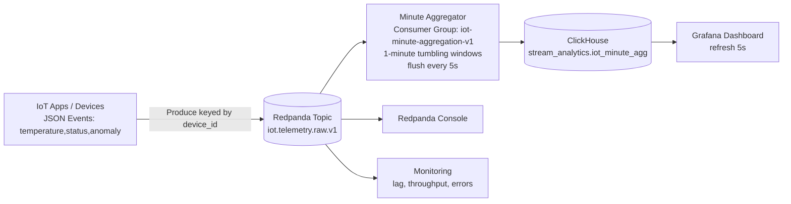

# Real-Time Data Reporting Architecture (Redpanda + ClickHouse + Grafana)

## Topic design
- `iot.telemetry.raw.v1`: primary inbound telemetry stream.
- `iot.telemetry.minute-agg.v1`: reserved for downstream pre-aggregated stream if a second-stage consumer is added.
- `iot.telemetry.dlq.v1`: malformed/unprocessable events.

## Partitioning strategy
- Key by `device_id` to preserve per-device ordering and spread load.
- Local dev: 24 partitions for `iot.telemetry.raw.v1`.
- Production baseline for 10k events/sec: start at 48 partitions and adjust to keep per-partition ingress under ~5 MB/s and consumer lag stable.

## Replication and retention
- Local dev uses replication factor `1`.
- Production: replication factor `3`, rack-aware placement, min ISR `2`.
- `iot.telemetry.raw.v1` retention: 7 days.
- `iot.telemetry.minute-agg.v1` retention: 30 days.
- `iot.telemetry.dlq.v1` retention: 14 days.
